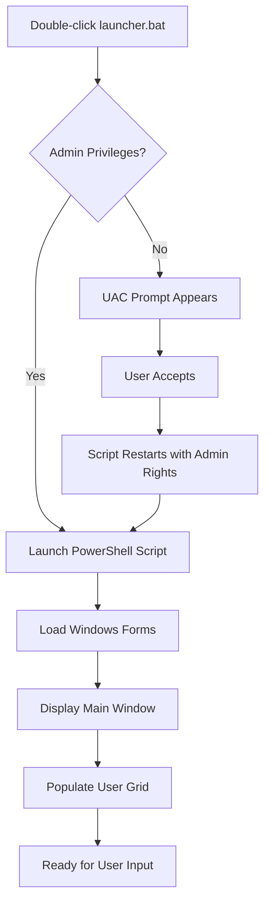
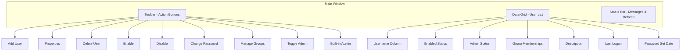
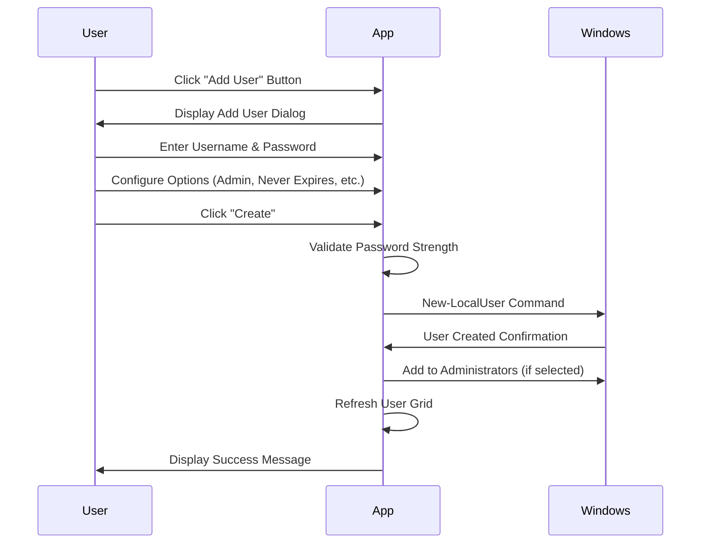
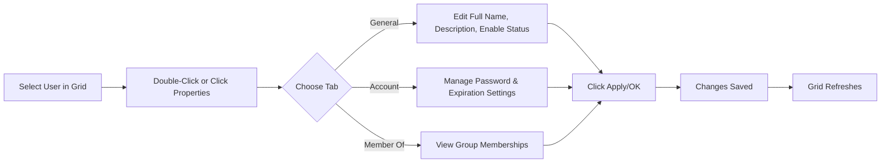
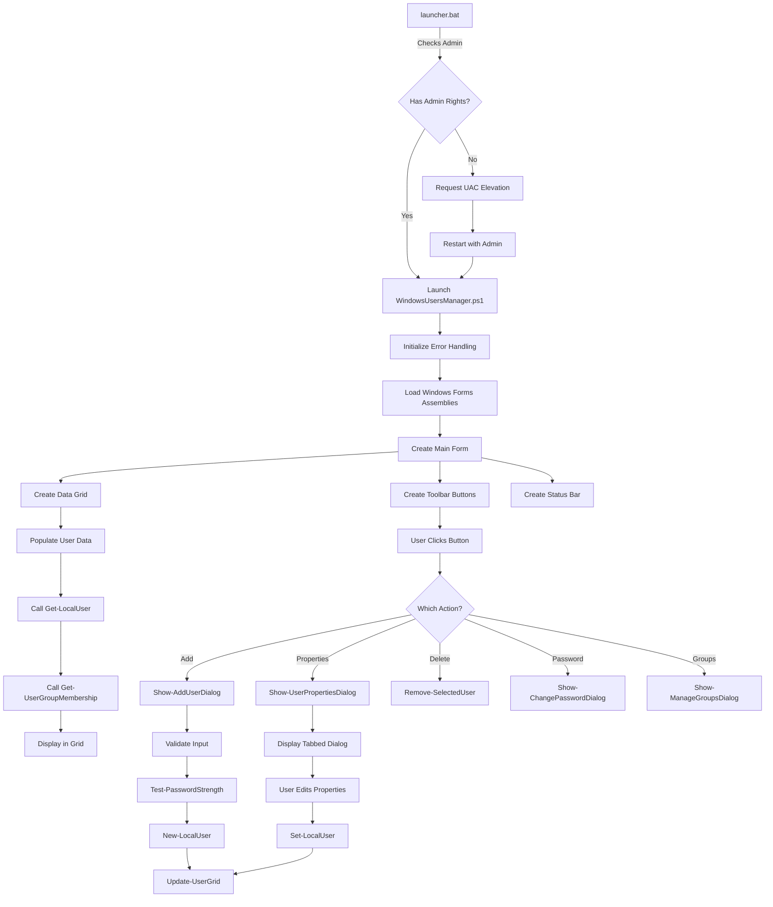

# xsukax Windows Users Manager

A professional, secure PowerShell-based GUI application for comprehensive management of local Windows user accounts. This tool provides system administrators with an intuitive interface to perform all essential user management tasks without relying on external dependencies or cloud services.

[](https://www.gnu.org/licenses/gpl-3.0)
[](https://docs.microsoft.com/en-us/powershell/)
[](https://www.microsoft.com/windows)

## 📋 Project Overview

xsukax Windows Users Manager is a robust, locally-executed PowerShell application that provides a graphical user interface for managing Windows local user accounts. The application leverages native Windows Forms and PowerShell cmdlets to deliver enterprise-grade user management capabilities without requiring additional software installations or internet connectivity.

**Primary Purpose:** Streamline and simplify the administration of local user accounts on Windows systems while maintaining complete control over user data and system security.

**Core Functionalities:**
- Create, modify, and delete local user accounts
- Enable or disable user accounts with one click
- Manage password policies and requirements
- Control group memberships and administrative privileges
- View comprehensive user properties and audit information
- Manage the built-in Administrator account
- Real-time status updates and comprehensive error logging

## 🔒 Security and Privacy Benefits

### Data Sovereignty
All operations are performed **locally** on your system. No data is transmitted to external servers, ensuring complete privacy and compliance with data protection regulations. Your user credentials and account information never leave your machine.

### Secure Credential Handling
- Passwords are processed using PowerShell's `SecureString` encryption in memory
- Password fields are masked during input to prevent shoulder surfing
- No plaintext passwords are stored or logged anywhere in the system
- Secure disposal of credential objects after processing

### Password Strength Enforcement
The application implements configurable password complexity requirements:
- Minimum length validation (8+ characters)
- Uppercase letter requirement
- Lowercase letter requirement
- Numeric character requirement
- Special character requirement

These safeguards prevent weak passwords that could compromise system security.

### Audit Trail and Logging
- Comprehensive error logging to track all operations
- Timestamped status messages for accountability
- Separate error log file for troubleshooting without exposing sensitive data
- No storage of successful authentication credentials

### Privilege Management
- Explicit administrator privilege checks before execution
- Visual warnings when granting elevated permissions
- Confirmation dialogs for destructive operations
- Clear separation between standard users and administrators

### Built-in Administrator Protection
Special functionality to manage the built-in Administrator account, allowing administrators to disable this high-privilege account when not in use, reducing the attack surface.

### No External Dependencies
The application uses only native Windows components (PowerShell 5.1+ and .NET Framework), eliminating supply chain security risks from third-party libraries or external services.

## ✨ Features and Advantages

### User-Friendly Interface
- **Intuitive GUI:** Modern Windows Forms interface with familiar controls
- **Tabbed Properties Dialog:** Organized user information across General, Account, and Group membership tabs
- **Data Grid View:** Sortable, searchable table displaying all user accounts at a glance
- **Real-time Updates:** Instant refresh capability with F5 keyboard shortcut
- **Status Bar:** Continuous feedback on operation progress and results

### Comprehensive User Management
- **Full User Lifecycle:** Create, read, update, and delete operations
- **Bulk Information Display:** View username, enabled status, administrator status, groups, description, last logon, and password age simultaneously
- **Password Management:** Change passwords with strength validation and policy enforcement
- **Account Control:** Enable, disable, or delete accounts with confirmation safeguards

### Group Membership Administration
- **Visual Group Manager:** Dual-list interface for intuitive group assignment
- **Multi-select Support:** Add or remove users from multiple groups simultaneously
- **Administrator Toggle:** Quick one-click promotion or demotion of administrator privileges
- **Complete Group Visibility:** View all local groups and membership status

### Advanced Features
- **"User Must Change Password at Next Logon":** Force password resets for security compliance
- **Password Never Expires:** Configure service accounts with permanent passwords
- **Account Expiration:** Set automatic account deactivation dates
- **Account Locking Status:** View and understand locked-out accounts
- **SID Display:** Access Security Identifiers for advanced troubleshooting

### Superior to Built-in Tools
| Feature | xsukax Users Manager | lusrmgr.msc | net user | Computer Management |
|---------|---------------------|-------------|----------|---------------------|
| GUI Interface | ✅ Modern | ⚠️ Legacy | ❌ CLI Only | ✅ Legacy |
| Batch Group Management | ✅ | ❌ | ❌ | ❌ |
| Password Strength Validation | ✅ | ❌ | ❌ | ❌ |
| One-Click Admin Toggle | ✅ | ❌ | ❌ | ❌ |
| Real-time Status Updates | ✅ | ❌ | ❌ | ❌ |
| Comprehensive Property View | ✅ | ⚠️ Limited | ❌ | ⚠️ Limited |
| No Installation Required | ✅ | ✅ | ✅ | ✅ |
| Error Logging | ✅ | ❌ | ❌ | ❌ |

### Portability and Ease of Use
- **No Installation:** Run directly from any location
- **Single File Execution:** Self-contained PowerShell script
- **Automatic Elevation:** Launcher handles UAC prompts automatically
- **Minimal Requirements:** Works on any Windows system with PowerShell 5.1+

## 💾 Installation Instructions

### Prerequisites

1. **Operating System:** Windows 7/8/10/11 or Windows Server 2008 R2 and later
2. **PowerShell:** Version 5.1 or higher (pre-installed on Windows 10/11)
3. **Administrator Privileges:** Required to manage user accounts
4. **.NET Framework:** 4.5 or higher (included in modern Windows)

### Verify PowerShell Version

Open PowerShell and run:
```powershell
$PSVersionTable.PSVersion
```

Ensure the `Major` version is 5 or higher.

### Installation Steps

#### Method 1: Download from GitHub (Recommended)

1. **Navigate to the repository:**
   ```
   https://github.com/xsukax/xsukax-Windows-Users-Manager
   ```

2. **Download the latest release:**
   - Click on the "Releases" section
   - Download the latest `.zip` file containing both `launcher.bat` and `WindowsUsersManager.ps1`
   
3. **Extract the archive:**
   - Right-click the downloaded `.zip` file
   - Select "Extract All..."
   - Choose a destination folder (e.g., `C:\Tools\WindowsUsersManager`)

4. **Unblock the files (Important):**
   - Right-click on `WindowsUsersManager.ps1`
   - Select "Properties"
   - If you see an "Unblock" checkbox at the bottom, check it and click "OK"
   - Repeat for `launcher.bat` if present

#### Method 2: Clone the Repository

```bash
git clone https://github.com/xsukax/xsukax-Windows-Users-Manager.git
cd xsukax-Windows-Users-Manager
```

Then unblock the files as described in Method 1, step 4.

### File Structure

After installation, your directory should contain:
```
WindowsUsersManager/
├── launcher.bat              # Launcher with automatic elevation
├── WindowsUsersManager.ps1   # Main application script
└── README.md                 # This documentation
```

### Execution Policy Configuration (If Needed)

If you encounter execution policy errors, you can:

**Option 1: Use the Launcher (Recommended)**
The `launcher.bat` file automatically bypasses execution policy for this script only.

**Option 2: Temporarily Allow Scripts**
```powershell
Set-ExecutionPolicy -Scope Process -ExecutionPolicy Bypass
```

**Option 3: Set User-Level Policy (Permanent)**
```powershell
Set-ExecutionPolicy -Scope CurrentUser -ExecutionPolicy RemoteSigned
```

## 🚀 Usage Guide

### Launching the Application

#### Using the Launcher (Easiest Method)

1. **Double-click `launcher.bat`**
2. Accept the UAC (User Account Control) prompt
3. The application window will appear automatically



#### Manual Launch

1. **Right-click PowerShell** and select "Run as Administrator"
2. Navigate to the script directory:
   ```powershell
   cd "C:\Path\To\WindowsUsersManager"
   ```
3. Execute the script:
   ```powershell
   .\WindowsUsersManager.ps1
   ```

### Application Interface Overview



### Common Workflows

#### Creating a New User



**Steps:**
1. Click **"Add User"** in the toolbar
2. Fill in the required fields:
   - **Username:** Must be unique (e.g., `john.doe`)
   - **Full Name:** Display name (e.g., `John Doe`)
   - **Description:** Optional (e.g., `Marketing Manager`)
   - **Password:** Must meet complexity requirements
   - **Confirm Password:** Must match
3. Configure options:
   - ☑️ User must change password at next logon
   - ☑️ Password never expires (mutually exclusive with above)
   - ☑️ Account is disabled (create but don't activate)
   - ☑️ Add to Administrators group (grants admin rights)
4. Click **"Create"**
5. The new user appears in the grid immediately

#### Modifying User Properties



**Steps:**
1. **Select a user** by clicking a row in the grid
2. Click **"Properties"** or **double-click** the row
3. Navigate tabs:
   - **General Tab:** Edit full name, description, enable/disable account, view SID
   - **Account Tab:** Configure password policies, account expiration, view last logon
   - **Member Of Tab:** View all group memberships
4. Make desired changes
5. Click **"Apply"** to save or **"OK"** to save and close

#### Managing Group Memberships

**Steps:**
1. Select a user in the grid
2. Click **"Manage Groups"**
3. The dialog shows two lists:
   - **Available Groups:** Groups the user is NOT a member of
   - **Member Of:** Groups the user IS a member of
4. To add to groups:
   - Select group(s) in "Available Groups" (hold Ctrl for multiple)
   - Click **"Add >>"**
5. To remove from groups:
   - Select group(s) in "Member Of"
   - Click **"<< Remove"**
6. Click **"Close"** when finished

#### Changing User Passwords

**Steps:**
1. Select a user in the grid
2. Click **"Change Password"**
3. Enter and confirm the new password
4. Optionally check:
   - ☑️ User must change password at next logon
   - ☑️ Password never expires
5. Click **"Change"**
6. Password is updated with the selected policies applied

#### Toggling Administrator Privileges

**Quick Method:**
1. Select a user in the grid
2. Click **"Toggle Admin"** (red button)
3. Confirm the action
4. The user is added to or removed from the Administrators group

#### Managing Built-in Administrator Account

The built-in Administrator account is a special account that should be disabled when not needed:

1. Click **"Built-in Admin"** (yellow button)
2. Choose to enable or disable based on current status
3. Confirm the action
4. The built-in Administrator account is shown/hidden from the login screen

### Keyboard Shortcuts

| Shortcut | Action |
|----------|--------|
| **F5** | Refresh user list |
| **Enter** | Accept dialog (when in a dialog box) |
| **Esc** | Cancel dialog (when in a dialog box) |
| **Double-Click Row** | Open user properties |

### Error Handling and Logging

The application logs all errors to:
```
%TEMP%\xsukax_WindowsUsersManager_Error.log
```

**To view the error log:**
1. Press **Win + R**
2. Type `%TEMP%` and press Enter
3. Find `xsukax_WindowsUsersManager_Error.log`
4. Open with Notepad

Each error entry includes:
- Timestamp
- Error message
- Function that generated the error

### Application Architecture



## 📄 Licensing Information

This project is licensed under the GNU General Public License v3.0.

## 🤝 Contributing

Contributions are welcome! Please feel free to submit a Pull Request to the repository at:
```
https://github.com/xsukax/xsukax-Windows-Users-Manager
```

### Development Guidelines

- Follow PowerShell best practices
- Maintain comprehensive error handling
- Add comments for complex logic
- Test on multiple Windows versions
- Update documentation for new features

## 🐛 Troubleshooting

### Common Issues

**Issue:** "Execution Policy" error when running the script

**Solution:** Use `launcher.bat` which automatically bypasses execution policy, or run:
```powershell
Set-ExecutionPolicy -Scope Process -ExecutionPolicy Bypass
```

---

**Issue:** "Failed to load Windows Forms assemblies"

**Solution:** Ensure .NET Framework 4.5+ is installed. Update Windows if necessary.

---

**Issue:** Changes don't appear immediately

**Solution:** Press **F5** to refresh the user grid, or click the "Refresh" button in the status bar.

---

**Issue:** Cannot delete or disable currently logged-in user

**Solution:** This is a Windows security feature. Log in as a different administrator to manage the active user.

---

**Issue:** "Access Denied" errors

**Solution:** Ensure the application is running with Administrator privileges. Right-click `launcher.bat` and select "Run as Administrator" if automatic elevation fails.

## 🔄 Version History

### v2.1 (Current)
- Comprehensive error logging
- Enhanced password strength validation
- Improved UI responsiveness
- Built-in Administrator account management
- Status bar with real-time updates

### v2.0
- Complete rewrite with modern UI
- Tabbed properties dialog
- Group management interface
- Enhanced security features

### v1.0
- Initial release
- Basic user management functionality

## 📞 Support

For issues, questions, or feature requests, please:
1. Check the [Issues](https://github.com/xsukax/xsukax-Windows-Users-Manager/issues) page
2. Create a new issue with detailed information
3. Include error log contents if applicable

## 🌟 Acknowledgments

Created by **xsukax**  
Website: Tech Me Away !!!

Special thanks to the PowerShell and Windows administrator communities for their valuable feedback and testing.

---

**⚠️ Important Security Note:** Always maintain multiple administrator accounts and never delete all administrator accounts from a system. Ensure you have a recovery method before making significant changes to user accounts.
